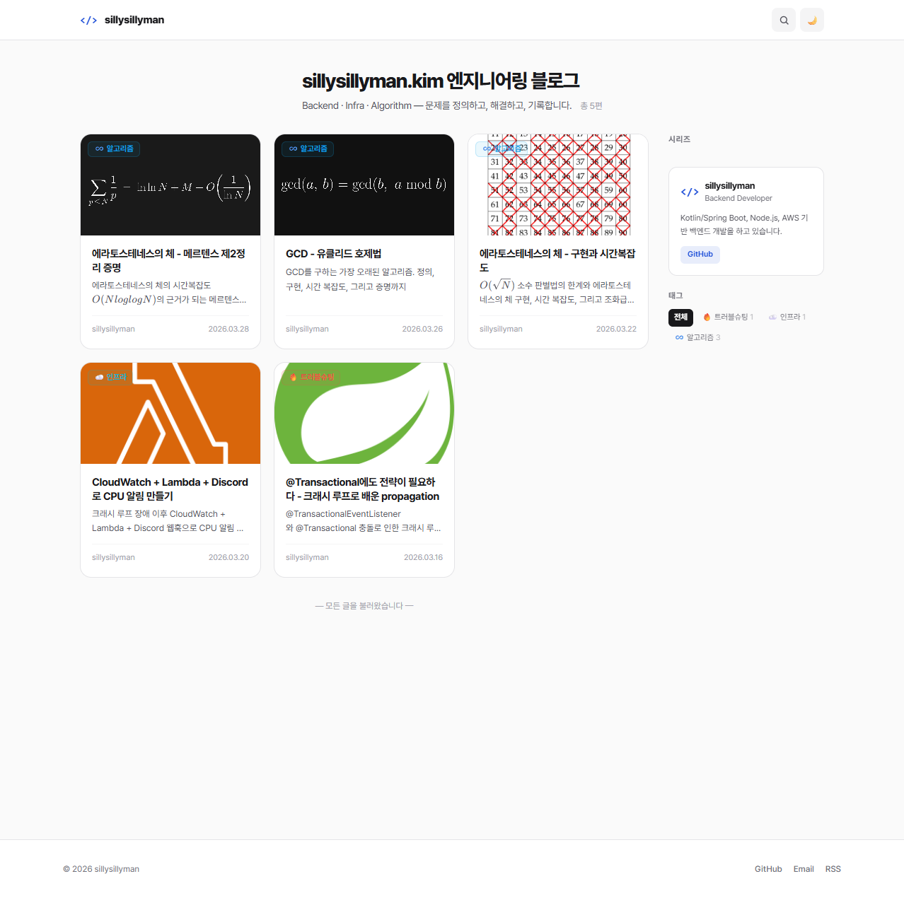
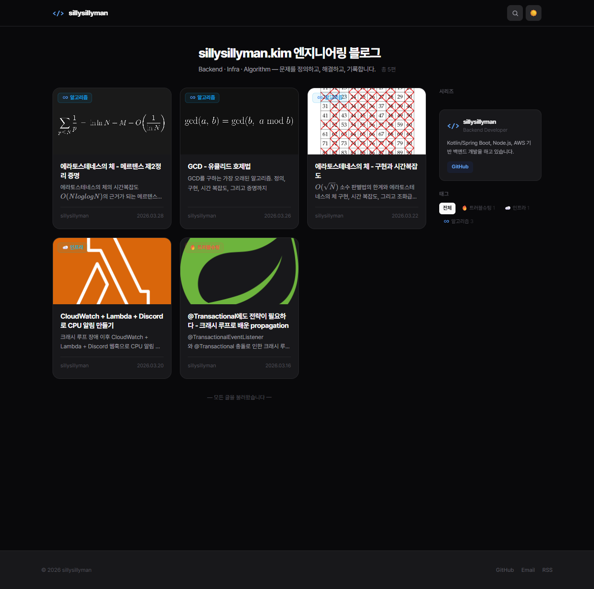
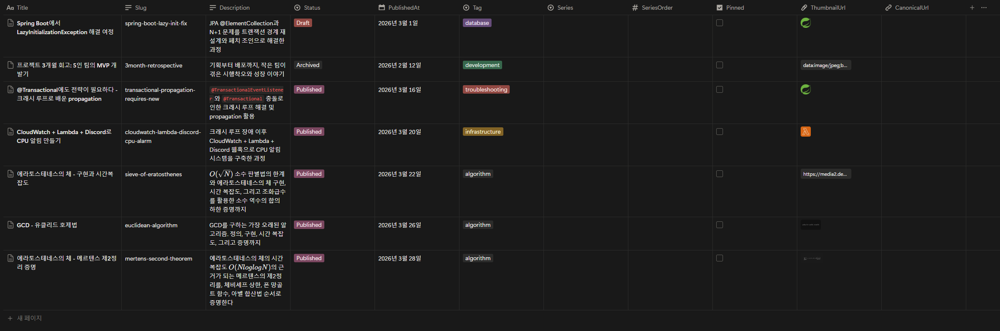

# Notion Blog Template

[](https://github.com/sillysillyman/sillysillyman.kim/stargazers)
[](https://github.com/sillysillyman/sillysillyman.kim/fork)

[한국어](README.ko.md)

A developer blog template powered by Notion as a headless CMS. Fork it, edit one config file, and deploy.

**Demo**: [sillysillyman.kim](https://sillysillyman.kim)

| Light Mode | Dark Mode |
|------------|-----------|
|  |  |

## Features

- **Notion CMS** — Write posts in Notion, fetched automatically via API
- **ISR** — Incremental Static Regeneration (60s interval)
- **Dark mode** — System preference sync + manual toggle
- **Search & filter** — Real-time search by title/description/tag, tag/series filtering
- **Infinite scroll** — IntersectionObserver-based
- **Markdown** — Code highlighting, KaTeX math, Mermaid diagrams
- **SEO** — Dynamic metadata, Open Graph, sitemap, robots.txt, RSS
- **Comments** — Giscus (GitHub Discussions, optional)
- **Responsive** — 1-column mobile to 4-column desktop card grid

## Tech Stack

- Next.js 16 (App Router)
- React 19
- TypeScript
- Tailwind CSS v3
- Notion API
- Vercel

## Quick Start

### 1. Fork & Install

Click the **Fork** button at the top right of this repo, then clone your forked repo:

```bash
git clone https://github.com/<your-username>/<forked-repo>.git
cd <forked-repo>
npm install
```

### 2. Create a Notion Database

Create a new Notion database with the following properties:



| Property     | Notion Type   | Description                        |
| ------------ | ------------- | ---------------------------------- |
| Title        | Title         | Post title                         |
| Slug         | Text          | URL path (lowercase + hyphens)     |
| Description  | Text          | SEO summary                        |
| Status       | Select        | `Published` (live), `Draft` (local only), `Archived` (hidden) |
| PublishedAt  | Date          | Publish date                       |
| Tag          | Select        | Tag (see list below)               |
| Series       | Select        | Series (optional)                  |
| SeriesOrder  | Number        | Order within series (optional)     |
| Pinned       | Checkbox      | Pin to top (optional)              |
| ThumbnailUrl | Files & media | Cover image (optional)             |
| CanonicalURL | URL           | Original URL for SEO (optional)    |

Then create a [Notion Integration](https://www.notion.so/profile/integrations) and connect it to your database (database page `···` → `Connections` → add your integration).

### 3. Configure Your Site

Edit `lib/config.ts` with your own information:

```ts
export const config = {
  name: 'My Blog',
  description: 'A short description of your blog',
  locale: 'ko_KR',
  language: 'ko',
  keywords: ['blog', 'development', ...],

  author: {
    name: 'Your Name',
    title: 'Your Title',
    bio: 'A brief bio about yourself',
    email: 'you@example.com',
    github: 'https://github.com/yourusername',
  },

  charsPerMinute: 500, // 500 for CJK, 200-250 for English

  verification: {
    google: '', // Google Search Console (optional)
  },
};
```

### 4. Set Environment Variables

Copy `.env.example` to `.env.local`:

```bash
cp .env.example .env.local
```

To find your Database ID, open the database as a full page in Notion and check the browser URL:

```
https://www.notion.so/<DATABASE_ID>?v=<VIEW_ID>
                      ^^^^^^^^^^^^^^^^
                      This 32-char string is your Database ID
```

```env
# Required
NOTION_API_KEY=secret_xxx        # From Notion Integration
NOTION_DATABASE_ID=xxx           # 32-char ID from the URL above
SITE_URL=https://yourdomain.com  # Your deploy domain

# Optional — Giscus comments (disabled if not set)
NEXT_PUBLIC_GISCUS_REPO=username/repo
NEXT_PUBLIC_GISCUS_REPO_ID=R_xxx
NEXT_PUBLIC_GISCUS_CATEGORY_ID=DIC_xxx
```

Get your Giscus values at [giscus.app](https://giscus.app).

### 5. Run Locally

```bash
npm run dev
```

Open `http://localhost:3000`.

### 6. Deploy to Vercel

1. Go to [Vercel](https://vercel.com) → **Add New Project** → Import your forked repo
2. Add the same environment variables from `.env.local`
3. **Deploy**

Set up a custom domain in Vercel project Settings > Domains.

## Customization

### Tags

Edit `TAG_MAP` in `lib/constants.ts` to add, modify, or remove tags. Make sure to update the Tag select options in your Notion database accordingly.

```ts
export const TAG_MAP: Record<string, TagInfo> = {
  // English key stored in Notion → displayed label + color
  troubleshooting: {
    id: 'troubleshooting',
    label: 'Troubleshooting',
    emoji: '🔥',
    color: { from: '#ef4444', to: '#dc2626' },
  },
  // Add more tags...
};
```

### Series

Edit `SERIES_MAP` in `lib/constants.ts`. Update the Series select options in your Notion database accordingly.

```ts
export const SERIES_MAP: Record<string, SeriesInfo> = {
  'my-series': {
    id: 'my-series',
    label: 'My Series',
    emoji: '📚',
  },
};
```

## Project Structure

```
lib/config.ts          # Site config (edit after fork)
lib/constants.ts       # Tag/series definitions
lib/notion.ts          # Notion API client
app/
├── layout.tsx         # Root layout
├── page.tsx           # Home page
├── posts/[slug]/      # Post detail page
├── api/posts/         # Posts API (ISR 60s)
├── feed.xml/          # RSS feed
├── sitemap.ts         # Dynamic sitemap
└── robots.ts          # robots.txt
components/            # UI components
```

## Commands

```bash
npm run dev      # Dev server
npm run build    # Production build
npm run lint     # ESLint
```

## License

[MIT](LICENSE)
